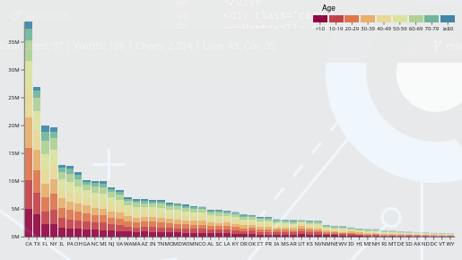

# D3 Charts Collection
 built with observable framework.

```
npm install
```

Then, to start the local preview server, run:

```
npm run dev
```

Then visit <http://localhost:3000> to preview your app.

## Example Charts

### World History Timeline


### Radial Bar Chart


### Vertically stacked bars


## Line charts

### Regular


### Multiline


### Slope


### Candle

